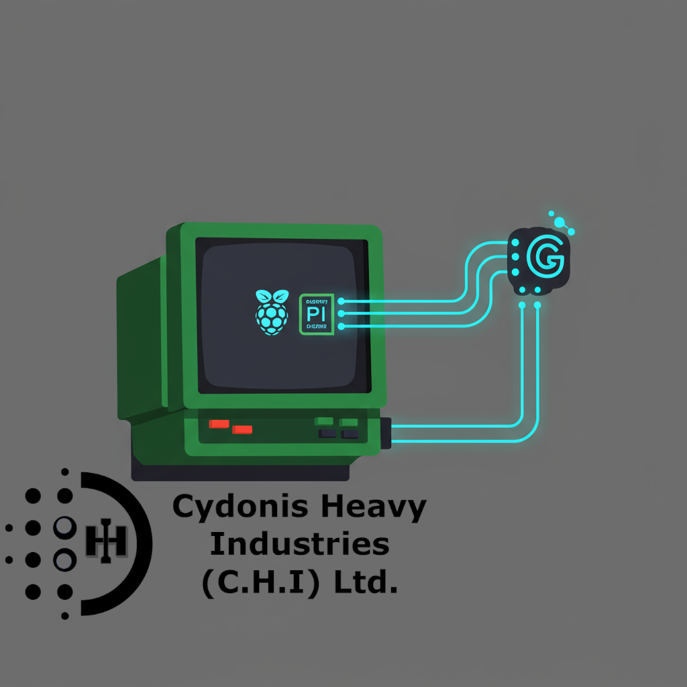

# AmstradGemini-Cyd0n1a

A series of scripts that listens for prompts from an Amstrad CPC (or similar Z80 retro computer) via a serial connection, sends the prompt to the Gemini API, and then sends the processed response back to the Amstrad CPC or similar Z80 based retro system. MLM's like it's the 1980's! ^_^v
